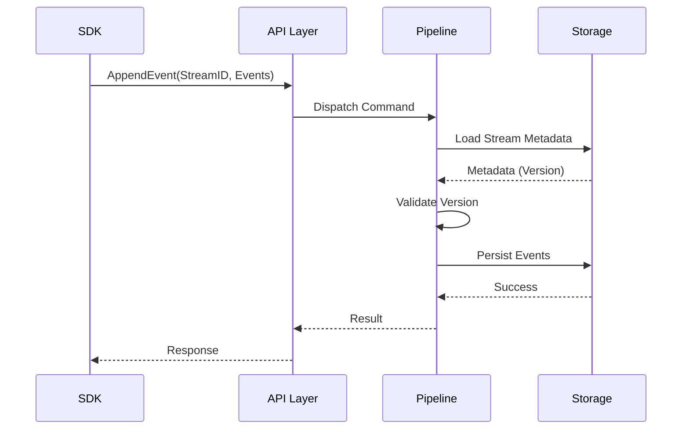

# Architecture

## Overview

GraveyardDB uses a layered Rust architecture to separate API handling, routing, domain logic, and storage concerns. The current layout favors explicit boundaries over hidden framework magic.

## System Context

The system is consumed by SDKs through gRPC.

```mermaid
graph LR
    User[SDK Application] -- gRPC --> System[GraveyardDB]
    System -- Persists to --> Storage[Storage Engine\n(RocksDB/ScyllaDB)]
```

## Container Diagram

The application is divided into several logical modules:

* API Layer (`src/grpc`): gRPC requests, proto/domain conversion, auth interception, and snapshot endpoints.
* Pipeline Layer (`src/pipeline`): ownership routing, sharded workers, and write serialization.
* Domain Layer (`src/domain`): core event and schema types, conversions, and validation.
* Storage Layer (`src/storage`): event store and snapshot store implementations for RocksDB, ScyllaDB, and in-memory tests.

```mermaid
graph TD
    subgraph "GraveyardDB"
        API[API Module\n(gRPC)]
        Pipeline[Pipeline Module]
        Storage[Storage Interface]
        DB[(RocksDB / Scylla)]

        API -->|Commands| Pipeline
        Pipeline -->|Read/Write| Storage
        Storage -->|IO| DB
    end
```

## Data Flow

### Append Event

1. SDK sends `AppendEventRequest` with a stream ID, batch of events, and expected version.
2. API converts proto events into domain events and preserves the stream ID.
3. Pipeline checks cluster ownership and either processes locally or forwards the request.
4. Worker shards serialize writes for the stream.
5. Storage persists the event and advances the stream version.
6. API returns success or a gRPC error to the SDK.

```mermaid
sequenceDiagram
    participant C as SDK
    participant A as API Layer
    participant P as Pipeline
    participant S as Storage

    C->>A: AppendEvent(StreamID, Events)
    A->>P: Dispatch Command
    P->>S: Load Stream Metadata
    S-->>P: Metadata (Version)
    P->>P: Validate Version
    P->>S: Persist Events
    S-->>P: Success
    P-->>A: Result
    A-->>C: Response
```

## Operational Notes

* TLS is optional and configured at startup when certificate paths are provided.
* Token-based auth is enforced through a gRPC interceptor when an auth token is configured.
* Cluster ownership is static and derived from `CLUSTER_NODES`; it is not a live membership protocol yet.
* Snapshot RPCs bypass the append pipeline and go directly to the snapshot store.
